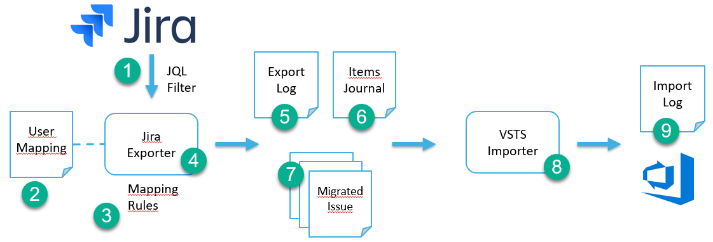

# Overview

The Jira to Azure DevOps work item migration tool lets you export data from Jira and import it as work items in Azure DevOps or Microsoft Team Foundation Server.

The migration process is done in two phases, first data is exported from Jira to text files. This can be done in a number of batches until the right set of items are ready for import.

The second step imports the data files to work items in Azure DevOps/TFS. 

The key capabilities of the tool includes:

- Jira items are exported based on JQL queries.
- Users can be translated during migration in order to maintain proper history.
- Field mapping is provided to map fields from the source to target account based on configuration file.
- State mapping between Jira and Azure DevOps states.
- History from Jira is maintained.
- Dates such as created or changed date are maintained. 
- Area/Iteration paths can be defaulted to a specific value when they don't exist in the target project.

# Migration process

## Jira requirements 

1. Identify the migration account (username and password) to access Jira
2. Get the url to Jira and the name of the source project

## Azure DevOps/TFS requirements

1. Get the name of the target Azure DevOps organization/TFS collection
2. Aquire a [personal access token](https://docs.microsoft.com/en-us/azure/devops/organizations/accounts/use-personal-access-tokens-to-authenticate) for the organization/collection with the following scopes
3. Get the url and the name of the target project. The import tool can create the target project if it does not already exist.
4. Discuss how users should be mapped between Jira and Azure DevOps/TFS.

## Migrate work items

The process below describes the high-level steps requred to migrate data from Jira to Azure DevOps.

1. Define a [Jira JQL filter](https://confluence.atlassian.com/jirasoftwarecloud/advanced-searching-764478330.html#Advancedsearching-ConstructingJQLqueries) for the items to export, for instance here's how to export all stories and sub-tasks from the SCRUM project:

        project = SCRUM AND issuetype in (Story, Sub-task) ORDER BY Rank ASC

2. Define how to map users
  
    This is an optional step but it's common that the names/account in Jira and Azure DevOps/TFS are different. Map Jira users to Azure DevOps/TFS users in a text file with email value pairs like this:

        Jira.User@some.domain=AzureDevOps.User@some.domain

3. Define [configuration](config.md) for the migration process.

4. Run the [export](jira-export.md) phase.

5. Review the export [logfile](logfile.md) (created for reference and troubleshooting).

6. The migration process tracks progress in a [journal file](journalfile.md). The journal makes it possible to resume a migration, for instance to import items that failed in the import due to configuration issues.

7. The export will generate [migration items](migration-item.md) for all Jira isses.

8. Run the [import](wi-import.md) phase.

9. Review the import [logfile](logfile.md) (created for reference and troubleshooting).

## Configuration schema

The options for configuring the migration process is documented [here](config.md).

## Sample

Sample configuration files are provided with documentation of typical migration settings in the "samples" folder.

|Sample|Description|
|---|---|
|[config-scrum.json](samples/config-scrum.json)|Configuration to migrate to a Scrum project|

## Known limitations
- Artifact links (other than git) are not migrated
- Board fields are not migrated
